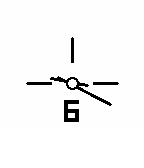
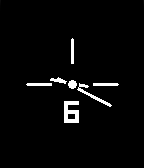
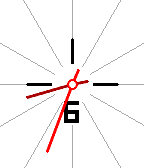
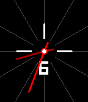
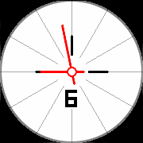
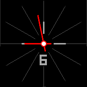
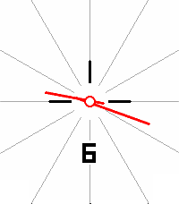
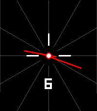

# Simple Enough

A minimalist analog watchface for Pebble smartwatches inspired by clean, modern clock design.

## Screenshots
### Pebble Classic/Steel/2/Duo

### Pebble Time/Time Steel

### Pebble Time Round

### Pebble Time 2

## Store
[Rebble App Store](https://apps.rebble.io/en_US/application/)

## Platform Support

- Aplite (144×168 B&W)
- Basalt (144×168 color)
- Chalk (180×180 round color)
- Diorite (144×168 B&W)
- Emery (200×228 color)
- Flint (144×168 B&W)

## Support
For issues, questions, or suggestions, please open an issue on GitHub.

## License
MIT License - feel free to modify and share!

---
Built with ❤️ for the Pebble community
